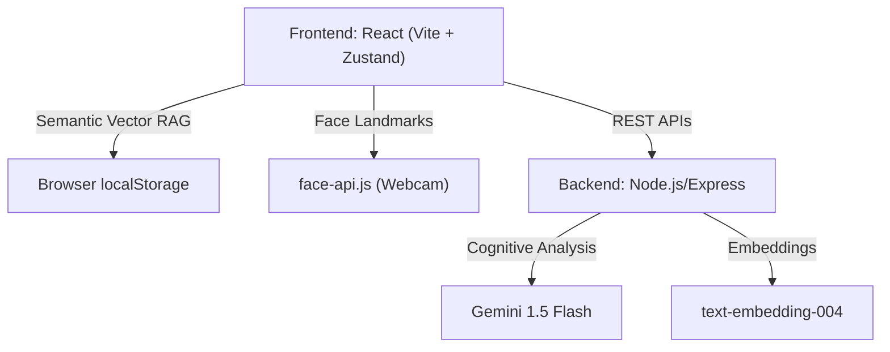

<div align="center">
  <!-- Replace with actual logo if available -->
  <!--  -->
  
  # OkaySpace
  
  **A Multimodal Neural Operating System for Your Mental Wellbeing**

  [](https://okay-space.vercel.app)
  [](https://reactjs.org/)
  [](https://nodejs.org/)
  [](https://ai.google.dev/)

  *Empathetic AI, real-time facial emotion recognition, and persistent semantic memory in a safe, privacy-first space.*
</div>

---

## About The Project

Mental wellbeing tools are often either prohibitively expensive or overly generic. **OkaySpace** bridges this gap by leveraging advanced multimodal AI (text + computer vision) and proven Cognitive Behavioral Therapy (CBT) techniques. It provides an accessible, private, and highly interactive environment for users to reflect, reframe negative thoughts, and navigate their emotions.

---

## Key Features

- **Echo (Multimodal AI Companion)**: A real-time, empathetic companion powered by **Gemini 1.5 Flash**. Echo dynamically observes your facial expressions (via webcam) and the linguistic sentiment of your text to formulate highly personalized, deeply empathetic responses.
- **Client-Side Semantic Memory (Local Vector RAG)**: Echo remembers your past conversations indefinitely. Using Gemini `text-embedding-004` and a custom-built, offline Cosine Similarity mathematical engine, Echo retrieves semantically relevant memories entirely on your device (via `localStorage`) to maintain absolute privacy.
- **Real-Time Facial Expression Detection**: Built on `face-api.js` (SSD Mobilenet V1), OkaySpace uses a hybridized ensemble classifier. It fuses a neural network with a custom geometric rule-engine based on the Facial Action Coding System (FACS) to correct AI hallucinations (e.g., distinguishing a distressed grimace from a happy smile by calculating the furrow-ratio between eyebrows).
- **Prism Reframing**: Instantly generates 6 distinct, multi-perspective reframes (e.g., Stoic, Compassionate, Future-Self) for any negative thought.
- **Immersive 3D UI & Dark Mode**: Utilizes Three.js and React Three Fiber to create a calming, organic, and visually soothing environment with native dark mode support.
- **Graceful Degradation**: Features a custom rule-based NLP fallback engine ensuring core functionalities remain available even without an active AI connection.

---

## See It In Action

*(Add a 20-second GIF here showing: Landing page → Type thought → Echo replies → Prism animation → Sentiment changes)*


| Landing Page | Echo Chat |
| :---: | :---: |
|  |  |
| **Prism Reframing** | **Analytics / Dashboard** |
|  |  |

---

## Technical Architecture

OkaySpace is built as a highly responsive Single Page Application (SPA) communicating with a robust real-time Node.js backend.



### Tech Stack
- **Frontend**: React 18, Vite, Zustand, Framer Motion, face-api.js, custom Vector Database Engine.
- **Backend**: Node.js, Express.js, Socket.io.
- **AI Models**: Google Gemini 1.5 Flash, Gemini `text-embedding-004`, SSD Mobilenet V1, faceLandmark68Net.
- **Testing**: Jest, Supertest.

---

## Challenges & Learnings

As a developer, building OkaySpace presented severe technical and product challenges:

- **Mathematical Emotion Correction (FACS Blending)**: Standard computer vision models often misinterpret intense crying as "happiness" because of shared physical traits (exposed teeth, squinted eyes, wide mouth). I solved this by mathematically calculating the "furrow ratio" (distance between inner eyebrows vs. inner eyes) using a 68-point facial landmark matrix, applying FACS (Facial Action Coding System) logic to override neural net false-positives dynamically.
- **Privacy-First Offline RAG**: I wanted Echo to have a long-term memory, but I refused to expose sensitive user journals to third-party cloud vector databases (like Pinecone). I solved this by building a custom Cosine Similarity search engine in pure TypeScript. Embeddings are generated statelessly via the backend, but the actual multidimensional vector search and index persistence run entirely sandboxed on the client's browser.
- **Optimizing Large Model Bundles**: Injecting deep learning models like `face-api.js` into a React app can destroy initial load times. I implemented dynamic code-splitting (`await import`) to ensure the 1.5MB vision models only execute if the user explicitly grants camera permissions.

---

## Getting Started

To get a local copy up and running, follow these simple steps.

### Prerequisites
- Node.js (v18 or higher)
- npm or yarn
- A Google Gemini API Key

### Installation

1. **Clone the repository**
   ```bash
   git clone https://github.com/Adhan-Hashim/OkaySpace.git
   cd OkaySpace
   ```

2. **Setup the Backend**
   ```bash
   cd server
   npm install
   cp .env.example .env # Configure your GEMINI_API_KEY here
   ```

3. **Setup the Frontend**
   ```bash
   cd ../client
   npm install --legacy-peer-deps
   ```

4. **Run the Application**
   ```bash
   # Terminal 1 (Start the server)
   cd server && npm run dev
   
   # Terminal 2 (Start the client)
   cd client && npm run dev
   ```
   *The application will now be running at `http://localhost:5173`.*

---

## Roadmap

- [ ] **Voice Integration**: Enable users to speak directly to Echo for hands-free interactions.
- [ ] **Emotion Timeline**: Visualize mood patterns and cognitive distortions over weeks and months.
- [ ] **Therapist Mode**: Securely export read-only summaries of cognitive patterns for real-world therapy sessions.

---

<div align="center">
  <i>If you found this project interesting, please consider giving it a star!</i>
</div>
