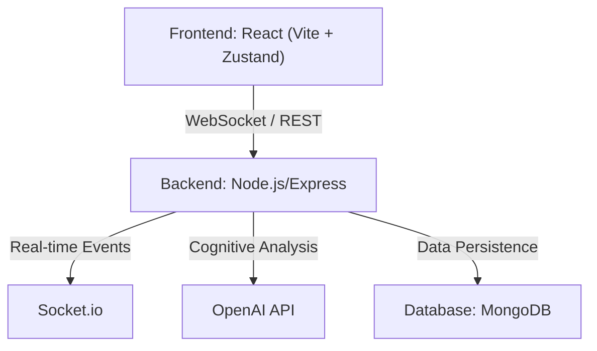

<div align="center">
  <!-- Replace with actual logo if available -->
  <!--  -->
  
  # OkaySpace
  
  **A Neural Operating System for Your Mental Wellbeing**

  [](https://okay-space.vercel.app)
  [](https://reactjs.org/)
  [](https://nodejs.org/)
  [](https://openai.com/)

  *Empathetic AI, cognitive restructuring, and real-time emotional processing in a safe, private space.*
</div>

---

## About The Project

Mental wellbeing tools are often either prohibitively expensive or overly generic. **OkaySpace** bridges this gap by leveraging conversational AI and proven Cognitive Behavioral Therapy (CBT) techniques. It provides an accessible, private, and highly interactive environment for users to reflect, reframe negative thoughts, and navigate their emotions.

**[Try the Live Application](https://okay-space.vercel.app)**

---

## Key Features

- **Echo (Conversational AI)**: A real-time, empathetic companion designed to guide users through cognitive restructuring and dialectical behavior therapy (DBT) practices.
- **Prism Reframing**: Instantly generates 6 distinct, multi-perspective reframes (e.g., Stoic, Compassionate, Future-Self) for any negative thought.
- **Real-time Sentiment Analysis**: Analyzes emotional intensity on the fly, providing users with immediate insights into their thought patterns.
- **Immersive 3D UI**: Utilizes Three.js and React Three Fiber to create a calming, organic, and visually soothing environment.
- **Native Dark Mode**: Seamlessly integrated across all views for comfortable nighttime usage.
- **Graceful Degradation**: Features a custom rule-based NLP fallback engine ensuring core functionalities remain available even without an active OpenAI connection.

---

## See It In Action

*(Add a 20-second GIF here showing: Landing page → Type thought → Echo replies → Prism animation → Sentiment changes)*


| Landing Page | Echo Chat |
| :---: | :---: |
|  |  |
| **Prism Reframing** | **Analytics / Dashboard** |
|  |  |

---

## Technical Architecture

OkaySpace is built as a highly responsive Single Page Application (SPA) communicating with a robust real-time Node.js backend.



### Tech Stack
- **Frontend**: React 18, Vite, Zustand (State Management), Framer Motion (Animations), Three.js / React Three Fiber.
- **Backend**: Node.js, Express.js, Socket.io (WebSockets).
- **Database**: MongoDB & Mongoose.
- **AI / NLP**: OpenAI API (GPT-4), Custom Heuristic Sentiment Engine.
- **Testing**: Jest, Supertest.

---

## Challenges & Learnings

As a developer, building OkaySpace presented several unique technical and product challenges:

- **Optimizing Real-Time AI Streaming**: Balancing the latency of the OpenAI API with a smooth, native-feeling user experience was a primary hurdle. I implemented optimistic UI updates and leveraged Framer Motion to mask asynchronous loading states seamlessly.
- **Resilient Fallback Systems**: Designing the system to degrade gracefully when the OpenAI API is unconfigured taught me how to architect robust fail-safes. I developed a custom rule-based sentiment engine, which proved to be an excellent deep dive into string parsing and heuristic design.
- **3D Rendering Performance**: Integrating Three.js via React Three Fiber initially caused frame rate drops on lower-end devices. I mitigated this by implementing geometry instancing and carefully managing render loops, ensuring the application remains lightweight and responsive across mobile and desktop.

---

## Getting Started

To get a local copy up and running, follow these simple steps.

### Prerequisites
- Node.js (v18 or higher)
- npm or yarn
- An OpenAI API Key (optional, for advanced AI features)

### Installation

1. **Clone the repository**
   ```bash
   git clone https://github.com/Adhan-Hashim/OkaySpace.git
   cd OkaySpace
   ```

2. **Setup the Backend**
   ```bash
   cd server
   npm install
   cp .env.example .env # Configure your MongoDB URI and OpenAI API Key here
   ```

3. **Setup the Frontend**
   ```bash
   cd ../client
   npm install --legacy-peer-deps
   ```

4. **Run the Application**
   ```bash
   # Terminal 1 (Start the server)
   cd server && npm run dev
   
   # Terminal 2 (Start the client)
   cd client && npm run dev
   ```
   *The application will now be running at `http://localhost:5173`.*

---

## Roadmap

- [ ] **Voice Integration**: Enable users to speak directly to Echo for hands-free interactions.
- [ ] **Emotion Timeline**: Visualize mood patterns and cognitive distortions over weeks and months.
- [ ] **Therapist Mode**: Securely export read-only summaries of cognitive patterns for real-world therapy sessions.
- [ ] **Multilingual Support**: Localize the platform for broader global accessibility.

---

<div align="center">
  <i>If you found this project interesting, please consider giving it a star!</i>
</div>
