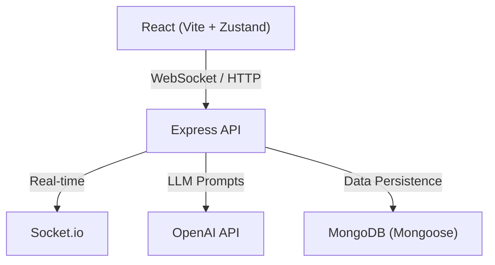

# OkaySpace

**[Live Demo: okayspace.vercel.app](https://okayspace.vercel.app)**

OkaySpace is a neural operating system for your mental wellbeing. It provides a safe space for cognitive restructuring, emotional reframing, and self-reflection, powered by modern AI.

---

### 🚀 See It In Action

*(Add a 20-second GIF here showing: Landing page → Type thought → Echo replies → Prism animation → Sentiment changes)*


---

## 💡 Why I Built It

Mental wellbeing tools are often either expensive or overly generic. OkaySpace explores how conversational AI and cognitive restructuring techniques can provide users with a supportive environment for self-reflection while remaining privacy-conscious and accessible.

---

## 📸 Screenshots

| Landing Page | Echo Chat |
| :---: | :---: |
|  |  |

| Prism Reframing | Analytics / Dashboard |
| :---: | :---: |
|  |  |

*(Dark Mode support included natively across all views)*

---

## 🏗️ Architecture



---

## 📂 Folder Structure

```text
OkaySpace/
├── client/              # React frontend (Vite, Zustand, Three.js)
│   ├── src/
│   │   ├── components/  # Reusable UI components
│   │   ├── views/       # Main app views (Home, Echo, Prism)
│   │   └── store/       # Zustand state management
├── server/              # Express backend
│   ├── controllers/     # Route logic (AI, CBT, Auth)
│   ├── models/          # Mongoose schemas
│   ├── routes/          # Express API routes
│   └── socket/          # WebSocket event handlers
└── shared/              # Types, constants, and utilities used across stack
```

---

## 🔌 Core API Endpoints

OkaySpace uses a RESTful architecture for cognitive processing.

- `POST /api/ai/echo` 
  - Submits a thought to the AI companion for empathetic CBT/DBT reflection.
- `POST /api/ai/echo-reframe` 
  - Analyzes a thought specifically for cognitive distortions (e.g., Catastrophizing).
- `POST /api/ai/prism` 
  - Multi-perspective reframing. Generates 6 different perspectives (stoic, compassionate, future-self) for a single negative thought.
- `POST /api/ai/sentiment`
  - Real-time sentiment and emotional intensity analysis.

*(Note: The API implements a smart, rule-based fallback engine if the OpenAI API key is omitted, ensuring local development is always possible).*

---

## 🛠️ Tech Stack

### Frontend
- **React 18** with **Vite** for rapid development.
- **Zustand** for state management.
- **Three.js** & **React Three Fiber** for immersive 3D background elements.
- **Framer Motion** for smooth, organic animations.

### Backend
- **Node.js** & **Express** server.
- **Socket.io** for real-time interactions.
- **OpenAI API** for the core cognitive restructuring engine.
- **MongoDB** (Mongoose) for data persistence.
- **Jest & Supertest** for automated API testing.

---

## 🧗 Challenges & Learnings

- **Real-Time AI Streaming vs Usability:** Balancing the latency of the OpenAI API with a smooth user experience was difficult. I learned how to implement optimistic UI updates and use Framer Motion to mask loading states seamlessly.
- **Graceful Degradation:** Designing a system that works even when the OpenAI API fails or is unconfigured taught me how to write robust fallback algorithms. The custom rule-based sentiment engine was a great exercise in string parsing and heuristic design.
- **3D Rendering Performance:** Integrating Three.js via React Three Fiber initially caused frame drops. I had to learn about geometry instancing and limiting render loops to keep the site responsive on mobile devices.

---

## 🔮 Future Work

- **Voice Conversations:** Allowing users to speak directly to Echo.
- **Emotion Timeline:** Visualizing mood patterns over weeks and months.
- **Journal & Habit Tracker:** Integrating daily actionable goals based on CBT insights.
- **Therapist Mode:** Allowing a user to securely export read-only summaries of their cognitive distortions for their real-life therapist.
- **Multilingual Support:** Localizing the platform for global accessibility.

---

## 🚀 Getting Started

### Prerequisites
- Node.js (v18 or higher)
- npm or yarn

### Installation

1. Clone the repository:
   ```bash
   git clone https://github.com/Adhan-Hashim/OkaySpace.git
   cd OkaySpace
   ```

2. Install backend dependencies:
   ```bash
   cd server
   npm install
   ```

3. Install frontend dependencies:
   ```bash
   cd ../client
   npm install --legacy-peer-deps
   ```

4. Set up environment variables:
   ```bash
   cp .env.example .env
   ```

5. Run the Application:
   ```bash
   # Terminal 1 (Server)
   cd server && npm run dev
   
   # Terminal 2 (Client)
   cd client && npm run dev
   ```

The application will be available at `http://localhost:5173`.
